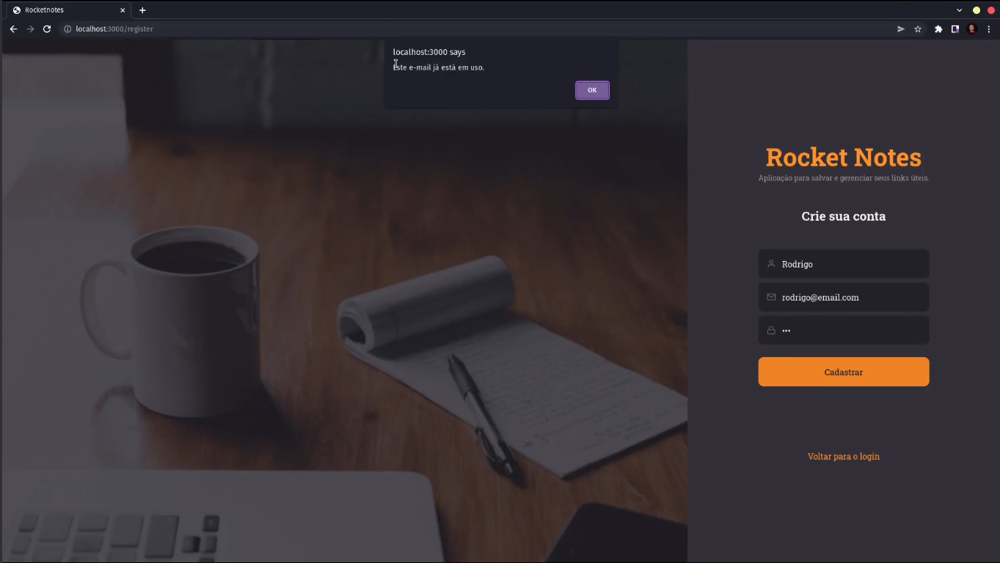
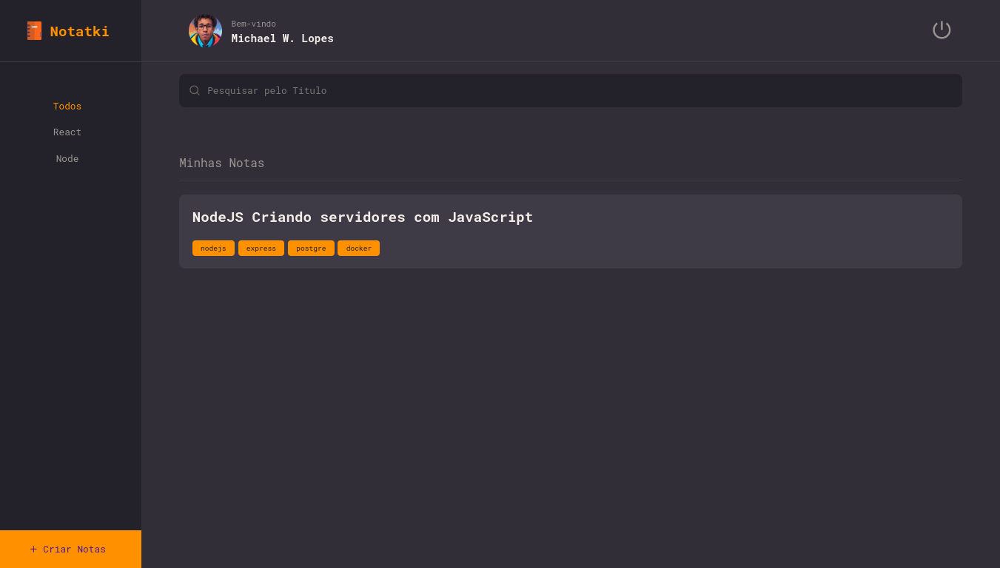
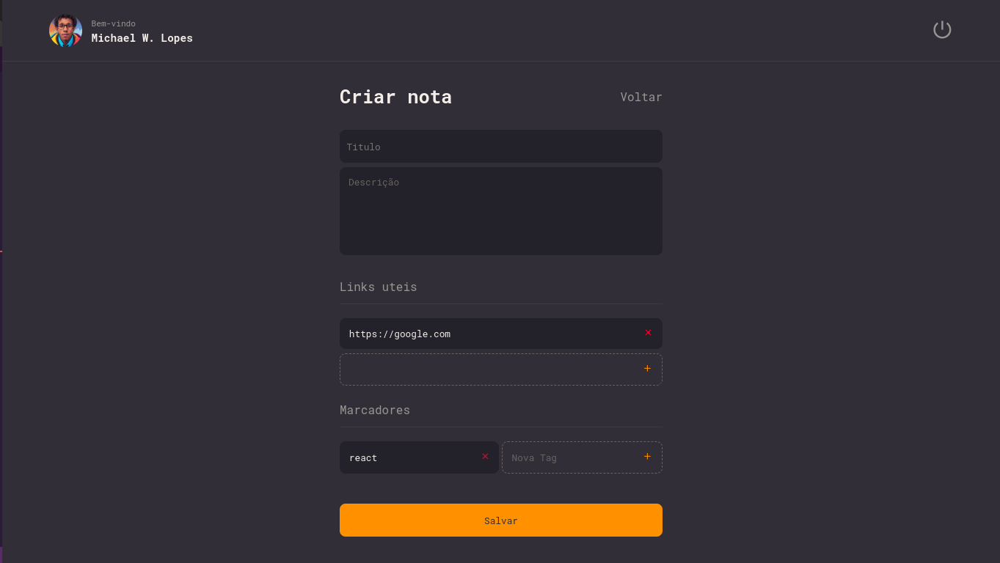
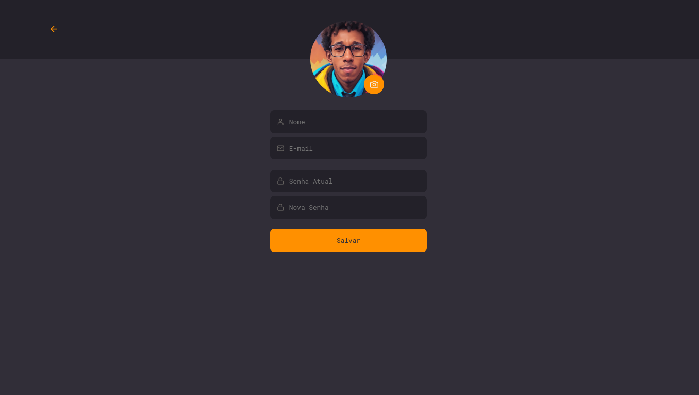

<h1 align="center">
    
</h1>

---

   
   
   
   
   

---

  Notakti é uma WebApp de criação de notas. Nesse aplicativo o usuário consegue criar, editar e excluir suas notas. É um app útil para salvar suas notas e links uteis que pode te auxiliar nos projetos e até nos estudos.

---

### Ferramentas utilizadas na aplicação:

- [Axios](https://github.com/axios/axios)
- [ReactJS Vitas](https://vitejs.dev/).
- [Styled-components](https://github.com/styled-components/styled-components)

### Ferramentas utilizadas no ambiente de desenvolvimento:

- [ESLint](https://github.com/eslint/eslint) - Lint para identificar erros em tempo de desenvolvimento.
- [Prettier](https://github.com/prettier/prettier) - Padroniza e melhora a visualização do código.

---

## :memo: Licença

Feito com :purple_heart: by [Michael W.Lopes](https://github.com/michael23-lopes)

---
